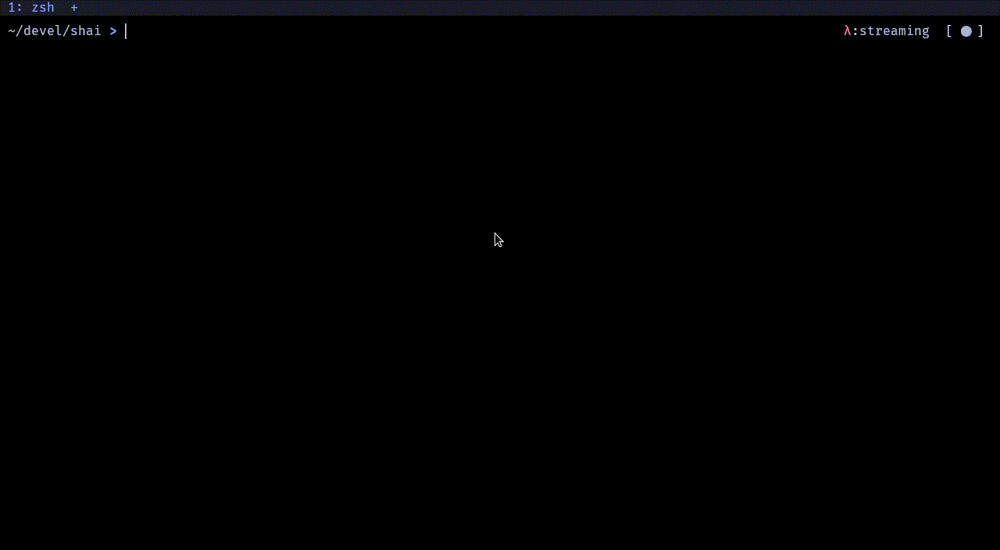

# Shai. Shell AI Assitant
Shai is a Shell AI assistant. Its purpose is to help you interact with your machine through
a command line interface. It has two main ways to achieve this.
- Command Generation: Shai allows you to quickly ask a LLM model to generate a command based on what it should do.
- Command Explanation: Given a command Shai will explain what a command will do and its side effects.




You'll interact with Shai primarily in its command generation mode. You can also ask Shai to explain the command
it just generated.


Note that the explanation will not take into account your initial prompt. This is purposely done to avoid biasing
the model explanation. In addition this can help double check that the model generated the correct command.

The model explanations will briefly explain the command and enumerate a list of common side-effects.
In addition if the command is potentially dangerous the model will usually point it out.

As a backend you can use any of the following OpenAI models:
- GPT-3.5-turbo
- GPT-3.5-turbo-16k : I've experienced lower latencies on the larger context models.
- GPT-4
- GPT-4-16k

For the time being I don't have access to the gpt-4 models API, but they should work if your account
does have access. All examples have been generated with GPT-3.5-turbo, so I expect the results from
GPT-4 to be equivalent or better (specially when the request has several moving parts).

Support for other models is planned. See [Current Status](#current-status)

Note that Shai is not intended to replace a solid knowledge of your system or its commands, but it
can help ease the burden of memorizing every single flag and command syntax. The OpenAI GPT models are
by no means foolproof and the best results are usually achieved when you as an operator already know
the terminology and capabilities related to the command you want to generate. It can also be a resource
to explain commands taken from tutorials or forums.

## Examples
### Git


### Docker


### Miscellaneous


## Installation
##### Cargo
```shell
cargo install shai
```

Note: See the [next section](#shell-integration) to integrate shai and allow it 
to interact with your buffer line

<!-- ##### Arch Linux. AUR: -->
<!-- ```shell -->
<!-- # TODO: -->
<!-- ``` -->

##### Other
Use the [latest release] in this github repo.
Put the binary in a location that is included in your `PATH`, source the corresponding integration
shell script (see [next section](#shell-integration)) in your rc file and you should be good to go.

### Shell Integration
I've developed Shai with the aim to have it very closely integrated in the shell. I tend to use it similarly to
[fzf](https://github.com/junegunn/fzf), so one key-shortcut away.

In this repository you will find the scripts needed to integrate Shai in your shell experience.
The following list contains the shells that are currently supported and the planned ones.

- [x] Bash
- [x] Zsh
- [x] Fish
- [x] Nushell
- [x] PowerShell
- [ ] Window CMD

In order for Shai to be available through shortcuts you'll need to source the corresponding
script. These scripts provide a default binding, modify it to adapt it to your needs.
All these scripts perform the same function, the setup a function that is called through the keybind.
The function takes the current content of your shell buffer, forwards it to Shai, and if the
command generation interface is being used and Shai is exited with `Ctrl+a` (accept), the buffer
line is modified with the command generated. In most cases the function essentially highjacks the
command edition capabilities of the shell treating Shai as a text editor.

| Shell           | Integration file           |
| --------------- | ---------------            |
| Bash            | `bash_assistant.sh`        |
| Zsh             | `zsh_assistant.zsh`        |
| Fish            | `fish_assistant.fish`      |
| Nushell         | `nushell_assistant.nu`     |
| PowerShell      | `powershell_assistant.ps1` |

If you just install the binary you can generate the integration script using shai
```shell
shai --generate-script <your-shell, one of {bash, zsh, fish, nushell, powershell}>
# e.g
shai --generate-script zsh > zsh_assistant.zsh
# then in your .zshrc
source zsh_assistant.zsh
```

## How to use it
You'll need to source the shell integration script of your shell (you can do that on your rc file).
This will make Shai available through key shortcuts and provide it with a way to edit your shell buffer line.

For example in zsh:
```shell
source zsh_assitant.zsh
```

Depending on what model you use you might need to provide the API key as an environment variable. For the OpenAI models
you could set it with:
```
export OPENAI_API_KEY=$(<command to get API key>)
# if you have it on a text file
export OPENAI_API_KEY=$(cat ~/.secrets/chatgpt.key)
```
See [here](https://help.openai.com/en/articles/4936850-where-do-i-find-my-secret-api-key) how to get your OpenAI API key.

### Shell Shortcuts
If you don't modify the shell integration script the shortcuts will be the following:
- `Alt+s` : Command Generation
- `Alt+e` : Command Explanation

You can change these shortcuts on the shell integration files. They have been chosen to avoid collision with already existing
shortcuts in *readline*.

### Shai Controls
- `Enter` : Send Prompt
- `Ctrl+c` : Exit Shai
- `Esc` : Cancel current request

#### Command Generation
When a command is generated the following controls are also available:
- `Ctrl+a` : Accept generated command
    - This will check that the model followed the format instructions, when the model provides a long answer
        this shortcut will retrieve only the text inside markdown code blocks.
- `Ctrl+r` : Accept generated command (raw)
    - This will accept the input from the model without any check
- `Ctrl+e` : Explain generated command
    - This will generate an explanation for the command that Shai has just generated.

These keybinds cannot currently be changed.

## Current Status
At the moment Shai is memoryless, when you send a prompt it is sent to the model without any
context from your previous prompts. The purpose of Shai is not to be a conversational application but
to quickly generate commands leveraging LLMs. I might implement conversational functionality later in
the future if it improves the commands produced.

I plan to add support for other models like [OpenAssistant](https://github.com/LAION-AI/Open-Assistant)
once they provide an API or a way to run it locally is available (even if the requirements for the machine
are steep, but within a high-end desktop). If you have pointers for other similar models that can be run
locally or have an available API please, fill an issue and I will try to add support for it.


### Context Awareness. Experimental!
Initially I envisioned Shai as a more capable assistant to which context about the current state
of your machine could be forwarded, and it would act accordingly. There are some options that are
disabled by default:

| Option           | Description                                                                                                  |
| ---------------- | ---------------                                                                                              |
| pwd              | Provides the model with the current working directory                                                        |
| depth            | depth with which to run the `tree` command. It provides context about ther current directory and its content |
| environment      | The list of environment variables set (only their name is passed to the model)                               |
| programs         | The list of available programs to the model with which to complete the task                                  |


I have found that the performance of the GPT3.5 model is lacking in this respect. I have
some hope that the GPT-4 (or future) models perform better, so the option to forward this context
to the model is still available, if you find good results with it let me know!


## Roadmap
In no particular order:
- [ ] Custom keybindings
- [ ] Prompt Overrides
- [ ] Add prompt history navigation.
- [ ] Add support for other models. (I'd like to make it easy to interact with a locally run model).
    - [x] OpenAI
    - [ ] Local
    - [ ] OpenAssistant (once a public API is available)
    - [ ] Google Bard (once a public API is available)
- [ ] Add other shells
    - [x] Bash
    - [x] Zsh
    - [x] Fish
    - [x] Nushell
    - [x] PowerShell
    - [ ] Window CMD

## Acknowlegments
- [fzf](https://github.com/junegunn/fzf)
    - fzf is the main inspiration in terms of the integration with the shell
- [ChatGPT-rs](https://github.com/Maxuss/chatgpt_rs)
    - I did take some hints from this project to implement the streaming responses from OpenAI.
